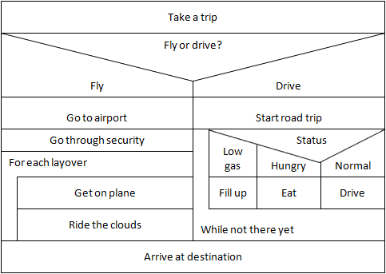

Curso de Algoritmo desenvolvido por Gustavo Guanabara, com diversas aulas para ajudar você a se especializar, incluindo testes com certificados para agregar em sua carreira. Todas as aulas com vídeos excelentes, super práticos e dinâmicos.

Link das aulas - https://www.cursoemvideo.com/curso/curso-de-algoritmo/

# Introdução a Algoritmos - Curso em Video

- O que é um algoritmo?

De acordo com o livro, Algoritmos Lógica para Desenvolvimento, do autor, José Augusto N. G. Manzano.
> Algortimos são conjuntos de passos finitos e organizados que, quando executados, resolvem um determinado problema.

### Algoritmos Computacionais

São passos a serem seguidos por um `módulo processador` e seus respectivos `usuários` que, quando executados na ordem correta, consegue `realizar` determinada `tarefa`.

- Modúlo Processador: é tudo aquilo que pode efetuar processamentos, tudo aquilo que pode ser programado.
- Usuários: pessoas que vão usar o programa

---
 
# Representando a Lógica de Programação

Usar a lógica é um fator a ser considerado por todos, principalmente pelos profissionais da Tecnologia

### Fluxograma
Ele mostra visualmente, de forma simples e clara, as diferentes etapas que compõem uma atividade, desde o início até o fim.
 - Visualização: Facilita a compreensão de processos complexos.
 - Comunicação: Permite que diferentes pessoas entendam o mesmo processo.
 - Identificação de problemas: Ajuda a encontrar gargalos e ineficiências.
 - Melhoria de processos: Permite otimizar e automatizar tarefas.


---

### Diagrama de Nasssi Shneiderman
O Diagrama de Nassi-Shneiderman (DNS), também conhecido como Estruturado, é uma técnica de representação gráfica de algoritmos que utiliza estruturas de controle bem definidas. Ele oferece uma forma clara e concisa de visualizar a lógica de um programa, sendo especialmente útil para a documentação e análise de código.
 - Estruturado: Baseia-se em três estruturas de controle fundamentais da programação: sequencia, seleção (if-then-else) e repetição (while, for).
 - Hierárquico: Os diagramas são construídos de forma hierárquica, com blocos aninhados representando diferentes níveis de detalhamento.
 - Gráfico: Utiliza formas geométricas simples para representar as estruturas de controle, tornando a leitura mais intuitiva.
 - Sem fluxo: Ao contrário de fluxogramas tradicionais, os DNS não utilizam setas para indicar o fluxo de controle, o que reduz a complexidade visual.
 


---

### Pseudocódigo - Portugol
O Portugol é uma variação do pseudocódigo especialmente desenvolvida para o ensino de programação no Brasil. Ele utiliza palavras em português e uma sintaxe simplificada, tornando o aprendizado mais intuitivo para quem está começando a programar.
- Linguagem intermediária: O pseudocódigo não é uma linguagem de programação propriamente dita, mas sim uma representação textual de um algoritmo, utilizando uma linguagem natural (no caso do Portugol, o português) com elementos de programação.
- Objetivo: Seu principal objetivo é descrever a lógica de um programa de forma clara e concisa, sem se preocupar com a sintaxe específica de uma linguagem de programação particular.
- Vantagens: Facilita a compreensão de algoritmos, auxilia na criação de fluxogramas e é uma excelente ferramenta para planejar a resolução de problemas antes de implementar o código em uma linguagem de programação real.

```Portugol Visualg
algoritmo "Calculadora Simples"
var
    num1, num2, resultado: inteiro

inicio
    escreva("Digite o primeiro número: ")
    leia(num1)
    escreva("Digite o segundo número: ")
    leia(num2)

    resultado <- num1 + num2

    escreva("A soma é: ", resultado)
fimalgoritmo
```


O VisualG é um software gratuito e de código aberto, amplamente utilizado no ensino de programação, especialmente no Brasil. Ele foi desenvolvido para facilitar a compreensão dos conceitos básicos da programação, permitindo que os estudantes foquem na lógica dos algoritmos sem se preocupar com os detalhes sintáticos de uma linguagem de programação específica.


