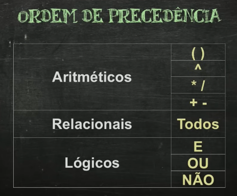

# Iniciando o VisualG

Para criar uma estrutura inicial pressione `! + CTRL espaço `

```VisualG
algoritmo "semnome"
var
    //Área de variáveis

inicio

    // Corpo do Algoritmos

fimalgoritmo
``` 
---

### Comandos de saída 

- `Escreva ("Sua mensagem")` - Tudo dentro de aspas, são considerados strings ou seja cadeias de caracteres.
- `Escreval` - Semelhante ao escreva, mais com a letra L no final, utilizado para pular a linha de baixo.

``` VisualG
algoritmo "semnome"
var

inicio
escreval ("Olá, mundo")
escreva ("Já me livrei da maldição!")

fimalgoritmo
```
Para executar o algoritmo, dentro do Visualg, pressione F9

---

### Variáveis

O que é uma variável?
Imagine uma caixa com um rótulo. Dentro dessa caixa, você pode guardar qualquer tipo de coisa: uma bola, um livro, um brinquedo. A caixa representa uma variável na programação.

Em programação, uma variável é como um recipiente que armazena um valor. Esse valor pode ser um número, um texto, um valor lógico (verdadeiro ou falso), ou até mesmo uma estrutura de dados mais complexa.

---

### Identificadores em Portugol: Uma Explicação Detalhada

O que são identificadores?

Em programação, um identificador é um nome que você atribui a um elemento do seu programa, como uma variável, uma constante, uma função ou um procedimento. É como um rótulo que você coloca em algo para poder se referir a ele mais tarde.

Existem 6 regras para identificadores no Visualg:

* Deve começar com uma letra
* Os próximos podem ser letras ou números.
* Não se pode utilizar nenhum símbolo, exceto _
* Não pode conter espaços em branco
* Não pode conter letras com acentos
* Não pode ser uma palavra reservada (palavras utilizadas pelo sistema, por exemplo: algoritmo, var, inicio, fimalgoritmo etc).

---

### Tipos Primitivos

Em Portugol, assim como em outras linguagens de programação, os tipos primitivos são os tipos de dados mais básicos e fundamentais. Eles definem a natureza dos valores que uma variável pode armazenar.

Organização: Ajudam a organizar os dados de forma eficiente na memória do computador.
Operações: Cada tipo de dado suporta um conjunto específico de operações. Por exemplo, você pode somar dois números inteiros, mas não pode somar um número inteiro com uma letra.
Eficiência: O computador aloca a quantidade correta de memória para cada tipo de dado, otimizando o uso dos recursos.
Quais são os principais tipos primitivos em Portugol?

Os tipos primitivos mais comuns em Portugol são:

* Inteiro: Representa números inteiros, positivos ou negativos. Exemplo: idade, quantidade.
* Real: Representa números reais, ou seja, números com casas decimais. Exemplo: altura, peso, pi.
* Caractere: Representa um único caractere, como uma letra, um número ou um símbolo. Exemplo: letra, simbolo.
* Lógico: Representa valores lógicos, ou seja, verdadeiro (verdadeiro) ou falso (falso). Exemplo: condicao, resultado.

---

### Atribuições em Portugol: Atribuindo Valores a Variáveis

Em programação, uma atribuição é a ação de dar um valor a uma variável. É como colocar um número, uma palavra ou qualquer outro tipo de dado dentro de uma caixa (a variável).
A sintaxe básica para atribuir um valor a uma variável em Portugol é:

`VisualG nome_da_variavel <- valor;`

O símbolo **<-** é o operador de atribuição e significa **recebe**.

``` VisualG
algoritmo "semnome"
var
  msg: caractere

inicio
msg <- "Olá, mundo"
escreva (msg)

fimalgoritmo
``` 
Note que no escreva, foi retirado as aspas

### Comandos de saída

* Escreva("msg") - Vai escrever msg
* Escreva(msg) - Vai escrever o conteúdo da variável msg
* Escreva("mensagem", msg) - Vai exibir 2 coisas, vai escrever mensagem e o conteúdo da variável msg

```VisualG
algoritmo "semnome"
var
  msg: caractere

inicio
msg <- "Olá, mundo"
escreval ("Mensagem: ", msg)

fimalgoritmo
```

### Comando de Entrada e Operadores

Comandos de Entrada:

leia: Captura dados do usuário e armazena em uma variável.
Exemplo: leia(idade);

**Operadores:**

* Aritméticos: Realizam cálculos (soma, subtração, multiplicação, divisão, módulo).
  - Exemplo: resultado <- numero1 + numero2;
* Relacionais: Comparam valores (igual, diferente, maior, menor).
  - Exemplo: se idade >= 18 entao
* Lógicos: Combinam condições lógicas (e, ou, não).
  - Exemplo: se (temCarteira && idade >= 18) entao

Em resumo:

Comandos de entrada: Interagem com o usuário.
Operadores: Realizam operações em valores.

```VisualG
algoritmo "meuNome"
var
   nome: caractere
   idade: inteiro

inicio

      escreval ("Digite seu nome?")
      Leia(nome)
      escreval ("Muito prazer, ", nome)
      escreval ("Qual a sua idade?")
      leia (idade)
       se idade >= 18 entao
      escreva(nome, ", você é maior de idade.")
       senao
      escreva(nome, ", você é menor de idade.")
      fimse
fimalgoritmo
```

### Exercício de somar valores

```Visualg
algoritmo "somarNumeros"
var
n1, n2, resultado: inteiro
inicio
escreva ("Infome um número: ")
leia(n1)
escreva ("Inforem outro número: ")
leia(n2)
resultado <- n1 + n2
escreval ("A soma entre o número ", n1, " e o número ", n2," é igual a ", resultado)

fimalgoritmo
``` 
---

### Operadores Aritméticos em Portugol
Operadores aritméticos são símbolos utilizados para realizar cálculos matemáticos básicos. Em Portugol, os principais são:

+: Adição
-: Subtração
*: Multiplicação
/: Divisão
\: Divisão inteira
^: Exponenciação
%: Módulo (resto da divisão)

```VisualG
algoritmo "semnome"
var

a, b, resultadoSomar, resultadoSubtrair, resultadoMultiplicacao: inteiro
resultadoDivisao, resultadoExponenciacao, resultadoModulo: real

inicio

escreva("Digite um número: ")
leia(a)
escreva("Digite outro número: ")
leia(b)
escreval("Os números informados foram ",a," e ", b)
resultadoSomar <- a + b
resultadoSubtrair <- a - b
resultadoMultiplicacao <- a * b
resultadoDivisao <- a / b
resultadoExponenciacao <- a ^ b
resultadoModulo <- a % b
escreval("A soma entre os números informados, são: ",resultadoSomar)
escreval("A subtração entre os números informados, são: ",resultadoSubtrair)
escreval("A multiplicalçao entre os números informados, são: ",resultadoMultiplicacao)
escreval ("A divisão entre os números informados, são: ",resultadoDivisao)
escreval ("A exponenciação entre os número informados, são: ",resultadoExponenciacao)
escreval ("O resto da divisão entre os números informados, são: ",resultadoModulo)
fimalgoritmo
```
---

### Ordem de Precedência em Operadores Aritméticos

A ordem em que as operações são realizadas em uma expressão matemática segue uma regra chamada ordem de precedência.

A ordem é a seguinte:
() PARÊNTESES
^ EXPONENCIAÇÃO
* / MULTIPLICAÇÃO E DIVISÃO
+- ADIÇÃO E SUBTRAÇÃO 

Parênteses: Tudo dentro de parênteses é calculado primeiro.
Multiplicação e Divisão: São realizadas antes da adição e subtração.

Adição e Subtração: São realizadas por último.
`resultado <- 2 + 3 * 4; // Resultado é 14 (3*4 primeiro)`

Para mudar a ordem, use parênteses:
`resultado <- (2 + 3) * 4; // Resultado é 20`

### Exercício de Cálcula de Média

```VisualG
algoritmo "semnome"
var

n1, n2: inteiro
media: real

inicio
escreva ("Informe um número: ")
leia(n1)
escreva ("Informe outro número: ")
leia(n2)
media <- (n1 + n2) / 2
escreva ("A media entre ",n1, " e ",n2," é igual ", media)

fimalgoritmo
```

### Funções Aritméticas 

Em Portugol, as funções aritméticas são como "mini-programas" que realizam cálculos específicos. Elas recebem valores como entrada, processam esses valores e retornam um resultado. Isso torna o código mais organizado, reutilizável e fácil de entender.

* ABS - Valor Absoluto
* EXP - Exponenciaçã
* INT - Valor Inteiro
* RaizQ - Raiz Quadrada
* Pi - Retorna PI
* Sen - Seno (rad)
* Cos - Cosseno (rad)
* Tan - Tangente (rad)
* GraupRad - Graus para rad

```VisualG
algoritmo "testeFuncoes"
var

a: inteiro
b, c: real


inicio
a <- abs(-50)
escreval(a)

b <- exp(9, 5)
escreval(b)

c <- int(RaizQ(81)) // Note aqui estamos pegando somente a parte inteira
escreval (c)

c <- sen(GraupRad(90))  //   Aqui é para saber o seno de 90, converte 90 para radianos e informo para função de seno
escreval(c)

fimalgoritmo
```
### Exercício de conversão

```VisualG
algoritmo "conversos"
var

 angulo, seno: real
 
inicio
escreva("Informe um angulo: ")
leia(angulo)
seno <- sen(GraupRad(angulo))
Escreva ("O seno de ", angulo, " é igual a ", seno )


fimalgoritmo
```
---

### Operadores Lógicos e Relacionais

Os operadores lógicos e relacionais são ferramentas essenciais em qualquer linguagem de programação, incluindo o Portugol. Eles permitem que você compare valores e construa expressões lógicas, tornando seus programas mais dinâmicos e capazes de tomar decisões.


### Operadores Relacionais
Os operadores relacionais são utilizados para comparar valores e retornar um resultado lógico (verdadeiro ou falso).

- Igualdade: = (igual a) e <> (diferente de)
- Desigualdade: < (menor que), > (maior que), <= (menor ou igual a), >= (maior ou igual a)

```VisualG
algoritmo "OperadoresRelacionais"
var
a, b, c: inteiro
inicio

a <- 2
b <- 3
c <- 5

escreval (a > b)        // retorna falso
escreval (a <> b)       // retorna verdadeiro
escreval (a >= 2 )       // retorna verdadeiro
escreval (c = a + b )      // retorna verdadeiro
escreval (c <= b ^ a )      // retorna verdadeiro
escreval (b <= c % 2 )      // retorna falso
escreval ( 1 = c % 2 )       // retorna verdadeiro

fimalgoritmo
```

### Operadores Lógicos
Os operadores lógicos combinam expressões lógicas e retornam um resultado lógico.

- E: e (conjunção) - Ambas as expressões devem ser verdadeiras para que o resultado seja verdadeiro.
- OU: ou (disjunção) - Pelo menos uma das expressões deve ser verdadeira para que o resultado seja verdadeiro.
- NÃO: nao (negação) - Inverte o valor lógico de uma expressão.

```VisualG
algoritmo "OperadoresLogicos"
var
a, b, c: inteiro
inicio

a <- 2
b <- 3
c <- 5

escreval ((a = b ) ou (c > a ))  // retorna verdadeiro
escreval (nao((a = b ) ou (c > a )))  // retorna falso


fimalgoritmo
```

---

### Ordem de Precedência



Ordem de Precedência dos Operadores: Aritméticos, Relacionais e Lógicos
A ordem em que as operações são realizadas em uma expressão é crucial para obter o resultado correto. Essa ordem é determinada pela precedência dos operadores.

A ordem geral é a seguinte:

- Operadores Aritméticos: São os operadores utilizados para realizar cálculos numéricos, como adição (+), subtração (-), multiplicação (*), divisão (/) e exponenciação (^).

- Operadores Relacionais: Utilizados para comparar valores, resultando em um valor lógico (verdadeiro ou falso). Exemplos: igualdade (==), desigualdade (!=), maior que (>), menor que (<), maior ou igual que (>=), menor ou igual que (<=).

- Operadores Lógicos: Utilizados para combinar expressões lógicas, resultando também em um valor lógico. Exemplos: E (AND), OU (OR), NÃO (NOT).
Em resumo, a ordem de precedência é:

* Aritméticos (primeiro)
* Relacionais (segundo)
* Lógicos (terceiro)

**Por que essa ordem?**

Cálculos antes de comparações: É mais natural realizar os cálculos numéricos antes de comparar os resultados.
Combinação de resultados: Os operadores lógicos combinam os resultados das comparações, formando expressões mais complexas.

### Exercício Triangulos
```VisualG
Algoritmo "triangulos"

Var

lado1, lado2, lado3: real
equilatero, escaleno, triangulo: logico

//Triângulo equilátero possui três lados iguais
//Um triângulo é escaleno quando possuem medidas diferentes

Inicio

escreval("Digite o primeiro lado: ")
leia(lado1)
escreval("Digite o segundo lado: ")
leia(lado2)
escreval("Digite o terceiro lado: ")
leia(lado3)
triangulo <- (lado1 < lado2 + lado3) e (lado2 < lado1 + lado3) e (lado3 < lado1 + lado2)
equilatero <- (lado1 - lado2) e (lado2 = lado3)
escaleno <- (lado1 <> lado2) e (lado2 <> lado3) e (lado1 <> lado3)
escreval ("Os valores podem formar um triangulo? ", triangulo)
escreval ("O triangulo e equilatero? ", equilatero)
escreval ("O triangulo e escaleno?", escaleno)


Fimalgoritmo
``` 