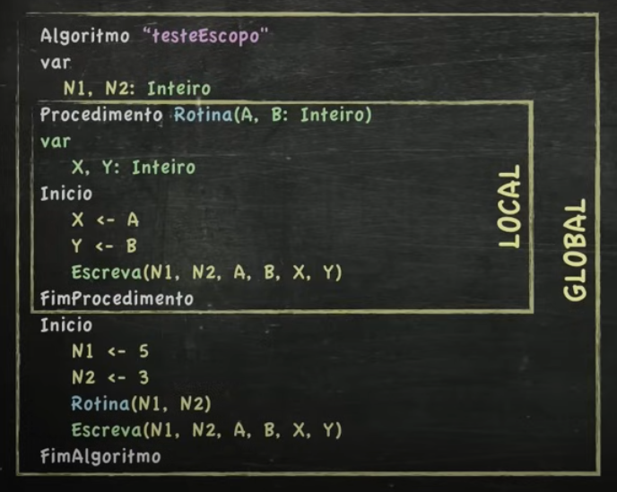

# Rotinas/Procedimentos: Blocos de Código Reutilizáveis

Rotinas ou procedimentos são como pequenas "funções" dentro de um programa que agrupam um conjunto de comandos e podem ser chamadas diversas vezes ao longo do código. Imagine que você tem uma receita de bolo: a receita em si é como o programa principal, e cada passo da receita (bater as claras, misturar os ingredientes) é como uma rotina.

## Por que usar rotinas?

- Reutilização de código: Evita a repetição de código, tornando o programa mais organizado e fácil de manter.
- Modularização: Divide o programa em partes menores e mais gerenciáveis, facilitando a compreensão e a depuração.
- Abstração: Permite criar blocos de código que realizam tarefas específicas, ocultando a complexidade interna.

### Como funcionam as rotinas no VisualG?

No VisualG, você declara uma rotina utilizando a palavra-chave procedimento. Dentro do procedimento, você coloca os comandos que deseja executar. Para chamar uma rotina, basta escrever o nome dela seguido de parênteses.

```Portugol Visualg
algoritmo "DetectorPesado"
var

I: Inteiro
N, Pesado: Caractere
P, Mai: Real
procedimento Topo()
inicio
LimpaTela
Escreval("-------------------------------------")
Escreval("D E T E C T O R    D E    P E S A D O")
Escreval(" Maior peso até agora: ", Mai, "Kg")
Escreval("-------------------------------------")
FimProcedimento
inicio
Topo()
Para I <- 1 Ate 5 Faca
     Escreva("Digite o nome: ")
     Leia(N)
     Escreva("Digite o peso de ", N, ": ")
     Leia(P)
     Se (P > Mai) Entao
     Mai <- P
     Pesado <- N
     FimSe
     Topo()
FimPara
     LimpaTela
     Topo()
     Escreval(" A Pessoa mais pesada foi ", Pesado, ", com ", Mai, " quilos.")

fimalgoritmo
```

---

### Passagem de Parâmetros
- Tipo 1: Por valor

```Portugol Visualg
Algoritmo "FazerSomaProcedimento"
Var

X, Y: Inteiro
Procedimento Soma(A, B: Inteiro)
Inicio
      Escreval("Recebi o valor ", A)
      Escreval("Recebi o valor ", B)
      Escreval("A soma entre os dois valores e", A + B)

FimProcedimento
Inicio
      X <- 5
      Y <- 3
      Soma(X,Y)

Fimalgoritmo
```

---

### Par ou Impar com Procedimento e Repita

```Portugol Visualg
algoritmo "ParOuImparProcedimento"
var

N: Inteiro
Resposta: Caractere
Procedimento ParOuImpar(V: Inteiro)
Inicio
      Se(V%2 = 0) Entao
           Escreval("O número ", V, " é PAR")
      SeNao
           Escreval("O número ", V, " é IMPAR")
      FimSe
FimProcedimento
inicio
      Repita
      Escreva("Digite um número: ")
      Leia(N)
      ParOuImpar(N)
      Escreval("Quer continuar [S/N] ?")
      Leia(Resposta)
      Ate(Resposta = "n")

fimalgoritmo
```

---

## Escopo

### Escopo Global e Escopo local

